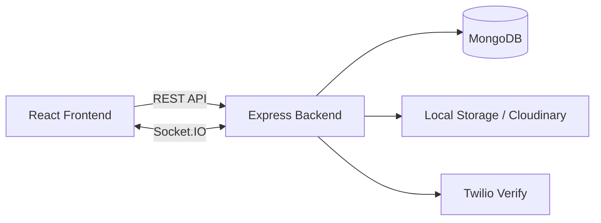

<div align="center">

# ZoHo - Collabspace

### A real-time collaboration workspace built with React, Node.js, MongoDB, and Socket.IO

Connect. Chat. Share. Stay in sync.

</div>

---

## Overview

ZoHo is a full-stack collaboration application that combines secure authentication, real-time messaging, file sharing, temporary status updates, and connection management in one workspace.

Rather than being a basic chat clone, the project focuses on practical product concerns: user identity, privacy, relationship states, live presence, media uploads, and a responsive interface.

> This is a personal learning project and is not affiliated with Zoho Corporation.

## Highlights

| Area | What it includes |
| --- | --- |
| Authentication | Email OTP, phone OTP through Twilio Verify, JWT sessions, and WebAuthn passkeys |
| Messaging | Real-time 1:1 and group conversations using Socket.IO |
| Connections | Send, accept, decline, remove, block, and unblock requests |
| Presence | Online/offline state, typing indicators, and message read status |
| Media | Image, video, audio, and document uploads |
| Status | 24-hour status updates with media, captions, and optional music |
| Storage | Local development storage with optional Cloudinary integration |
| Interface | Responsive React workspace with theme support |

## Architecture



```text
React frontend
  ├── Authentication and workspace views
  ├── REST API requests
  └── Socket.IO client for real-time events

Express backend
  ├── Routes → controllers → models
  ├── JWT-protected API endpoints
  ├── Multer upload handling
  └── Socket.IO server for messaging and presence

MongoDB
  ├── Users
  ├── Connections
  ├── Conversations
  ├── Messages
  ├── Files
  └── Status updates
```

## Connection model

CollabSpace uses a relationship-based connection model. Users cannot create a new direct conversation with every registered account immediately.

```text
No connection
      ↓
Pending request
      ↓
Accepted / Declined / Blocked
```

Each user pair has one unique relationship record, preventing duplicate or conflicting requests. A new one-to-one conversation can be created only after a connection has been accepted.

## Project structure

```text
CollabSpace/
│
├── backend/
│   ├── src/
│   │   ├── config/          # Database and Cloudinary configuration
│   │   ├── controllers/     # Application business logic
│   │   ├── middleware/      # Authentication and upload middleware
│   │   ├── models/          # Mongoose schemas
│   │   ├── routes/          # Express routes
│   │   ├── services/        # Email, Twilio, and storage services
│   │   ├── socket/          # Socket.IO server
│   │   └── utils/           # Shared helper functions
│   ├── uploads/             # Local development uploads
│   ├── index.js
│   ├── Dockerfile
│   └── docker-compose.yml
│
├── frontend/
│   ├── public/
│   ├── src/
│   │   ├── components/      # Authentication and workspace UI
│   │   ├── context/         # Shared React context
│   │   ├── utils/           # Frontend helpers
│   │   ├── App.js
│   │   └── config.js
│   ├── package.json
│   └── tailwind.config.js
│
├── .gitignore
└── README.md
```

## Tech stack

**Frontend**

- React 19
- Tailwind CSS
- Socket.IO Client
- Lucide React
- Three.js

**Backend**

- Node.js
- Express 5
- MongoDB and Mongoose
- Socket.IO
- JWT authentication
- Multer
- Nodemailer
- Twilio Verify
- SimpleWebAuthn
- Cloudinary

## Getting started

### Prerequisites

- Node.js 20 LTS recommended
- npm
- MongoDB Community Server or MongoDB Atlas
- Optional: Twilio, Cloudinary, and SMTP credentials

### 1. Clone the repository

```bash
git clone https://github.com/YOUR-USERNAME/collabspace.git
cd collabspace
```

### 2. Install backend dependencies

```bash
cd backend
npm ci
```

Configure your private local application settings, then start the backend:

```bash
npm run dev
```

The backend runs on:

```text
http://localhost:8000
```

### 3. Install frontend dependencies

Open a second terminal:

```bash
cd frontend
npm ci
npm start
```

Open the application at:

```text
http://localhost:3000
```

## Security notes

- Private credentials and API keys are intentionally excluded from this repository.
- Protected API routes use JWT authentication middleware.
- New direct conversations require an accepted connection.
- OTP login uses time-limited verification flows.
- Passkeys use WebAuthn for phishing-resistant authentication.
- Uploaded media receives unique storage identifiers to prevent filename conflicts.

## Author

**Harsh**

Built as a full-stack learning project focused on real-time systems, authentication, and product-oriented backend design.
